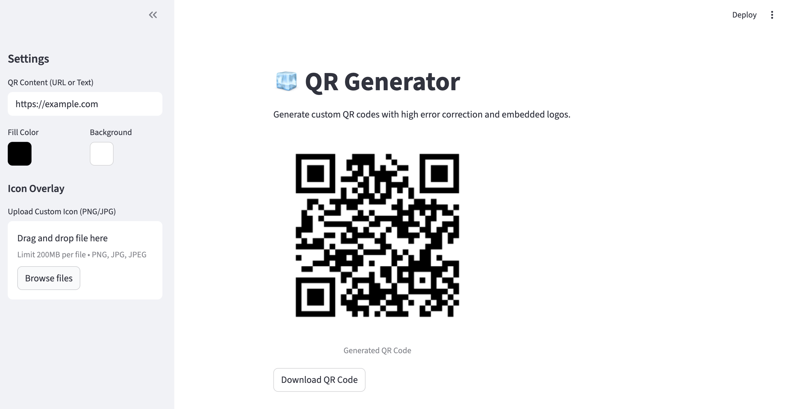

# QR Code Generator

A simple and powerful QR code generator built with Python and Streamlit. It supports high error correction to allow for custom icon overlays.

## Features

*   Generate QR codes from URL or text.
*   Customize fill and background colors.
*   Overlay a custom icon (centered).
*   Download as PNG.

## Installation

1.  **Clone the repository** (if you haven't already).
2.  **Install dependencies**:
    ```bash
    pip install -r requirements.txt
    ```

## Usage

Run the Streamlit app:

```bash
python -m streamlit run qr_tool/app.py
```

The web interface will open in your default browser.


## Project Structure

*   `qr_tool/generator.py`: Core QR generation logic using `qrcode` and `pillow`.
*   `qr_tool/app.py`: Streamlit web interface.
*   `assets/`: Directory for default assets (e.g., logos).
